# Day 3

## Lab - Deploying mariadb db server into openshift
Let's generate the mariadb deployment manifest file
```
oc create deployment mariadb --image=bitnami/mariadb:latest -o yaml --dry-run=client > mariadb-deploy.yml
oc apply -f mariadb-deploy.yml
oc get deploy,po
```

To troubleshoot why the pod is crashing, you could check the pod logs
```
oc logs mariadb-f5b894b56-2q8k8
```

As we can see, we didn't provide the root password, mariadb is crashing and deployment controller seem to attempt repair the issue by restarting the pod.  But the whole thing repeats again and it crashes.  So unless we fix the root cause openshift won't be able to run the mariadb pod.

Let's ensure the mariadb-deploy.yml supplies the MARIADB_ROOT_PASSWORD as an environment as shown below
<pre>
apiVersion: apps/v1
kind: Deployment
metadata:
  labels:
    app: mariadb
  name: mariadb
spec:
  replicas: 1
  selector:
    matchLabels:
      app: mariadb
  template:
    metadata:
      labels:
        app: mariadb
    spec:
      containers:
      - image: bitnami/mariadb:latest
        name: mariadb
        env:
        - name: MARIADB_ROOT_PASSWORD
          value: root@123  
</pre>

Now you may deploy mariadb into openshift
```
oc apply -f mariadb-deploy.yml
oc get deploy,rs,po
```

Getting inside the mariadb pod container shell.  When it prompts for password, type 'root@123' without the quotes.
```
oc rsh deploy/mariadb
mysql -u root -p
SHOW DATABASES;
CREATE DATABASE tektutor;
USE tektutor;
CREATE TABLE training ( id INT NOT NULL, name VARCHAR(200) NOT NULL, duration VARCHAR(200) NOT NULL, PRIMARY KEY(id) );
INSERT INTO training VALUES ( 1, "DevOps", "5 Days" );
INSERT INTO training VALUES ( 2, "Developing Linux Device Drivers", "5 Days" );
INSERT INTO training VALUES ( 3, "Advanced OpenShift Administration", "5 Days" );
SELECT INTO training;
exit
exit
```

Expected output


## Lab - Deploying mariadb db server that uses external nfs storage
```
cd ~/openshift-27may-2024
git pull
cd Day3/persistent-volume
oc apply -f pv.yml

oc get pv

oc apply -f pvc.yml

oc get pv,pvc
oc apply -f mariadb-deploy.yml
oc get po
```
Getting inside the mariadb pod container shell.  When it prompts for password, type 'root@123' without the quotes.
```
oc rsh deploy/mariadb
mysql -u root -p
SHOW DATABASES;
CREATE DATABASE tektutor;
USE tektutor;
CREATE TABLE training ( id INT NOT NULL, name VARCHAR(200) NOT NULL, duration VARCHAR(200) NOT NULL, PRIMARY KEY(id) );
INSERT INTO training VALUES ( 1, "DevOps", "5 Days" );
INSERT INTO training VALUES ( 2, "Developing Linux Device Drivers", "5 Days" );
INSERT INTO training VALUES ( 3, "Advanced OpenShift Administration", "5 Days" );
SELECT INTO training;
exit
exit
```

Let's delete the mariadb pod and observe that openshift automatically creates a new pod in the place of the old pod that we deleted.

Try to login to the new mariadb pod, mariadb root password is 'root@123'
```
oc rsh deploy/mariadb
mysql -u root -p
SHOW DATABASES;
USE tektutor;
SHOW TABLES;
SELECT * FROM training;
```

The expectation is, you should be able to see the tektutor database with training table. The records we inserted via the previous mariadb pod should be seen intact as we are using an external NFS storage.


## Lab - Deploying a multi-pod wordpress with mariadb application

```
cd ~/openshift-27may-2024
git pull
cd Day3/persistent-volume/wordpress
./deploy.sh
```

Expected output


Once you are done with the wordpress lab exercise, you can clean up the resources
```
cd ~/openshift-27may-2024
git pull
cd Day3/persistent-volume/wordpress
./delete-all.sh
```

Expected output


## Lab - Deploying mongodb with external NFS Storage
```
cd ~/openshift-27may-2024
git pull
cd Day3/persistent-volume/mongodb
./deploy.sh
```

Expected output

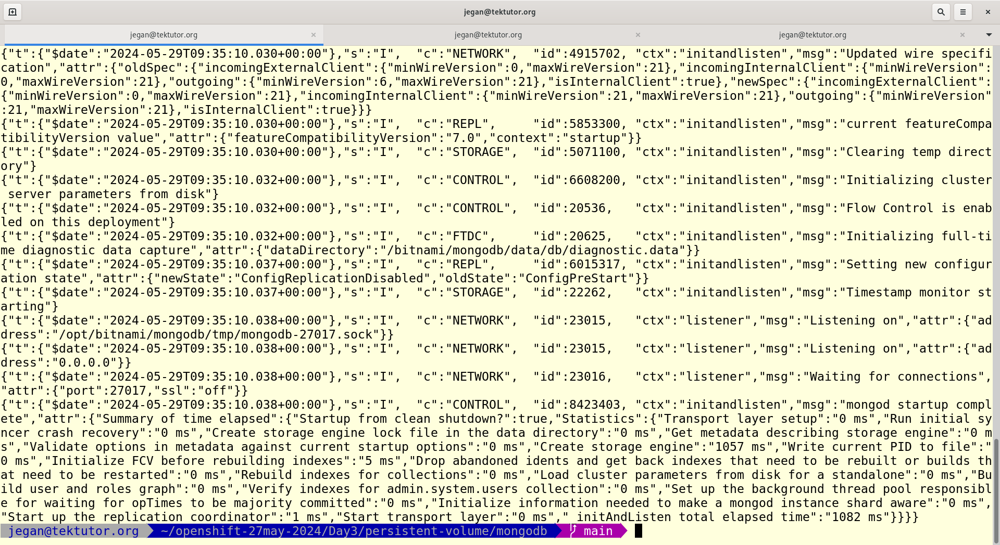
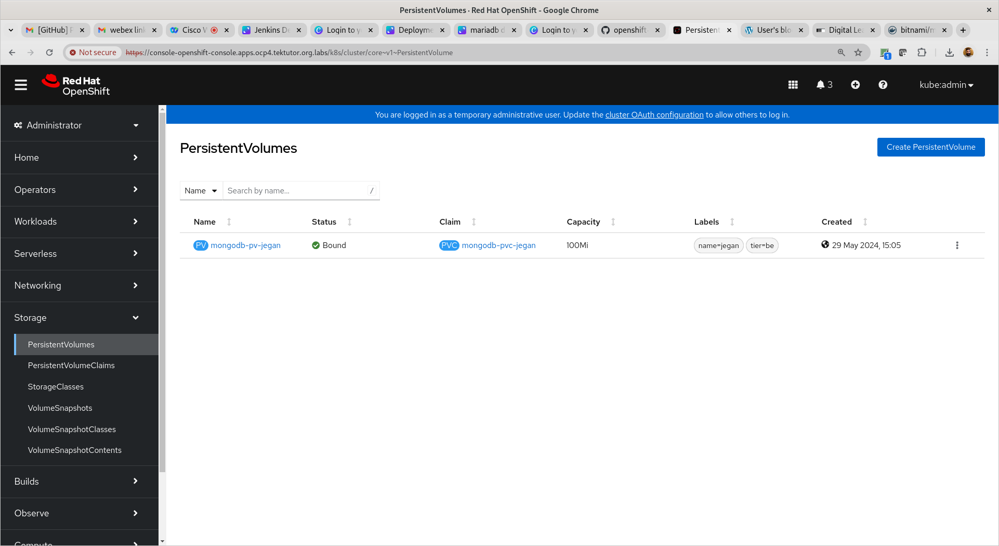
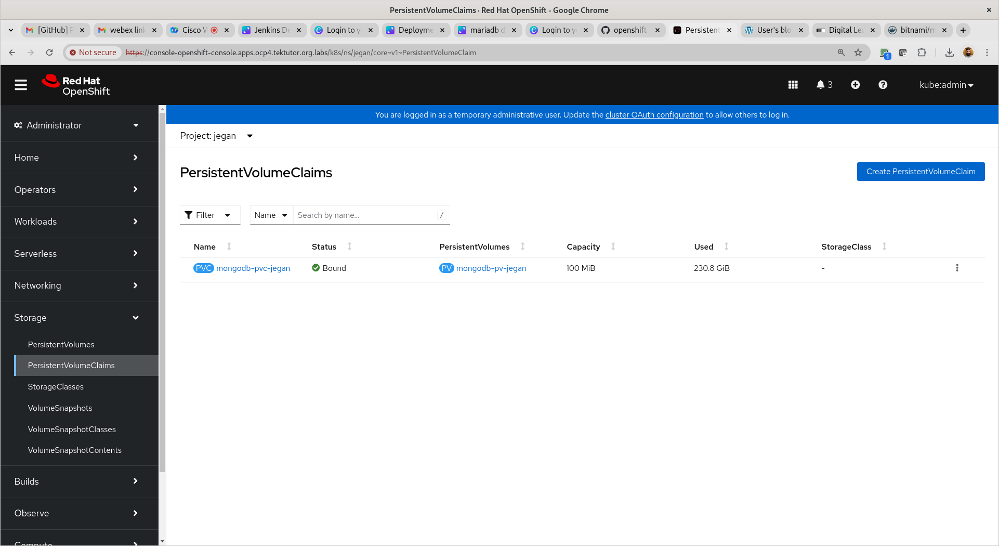
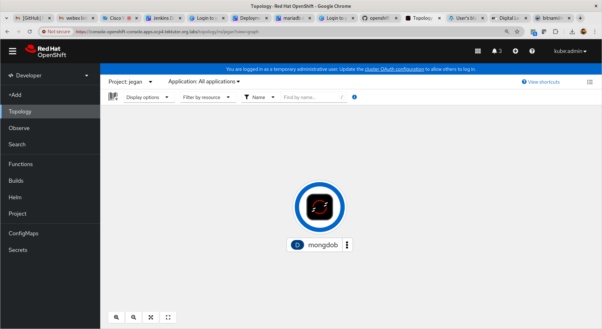

Once you are done with this exercise, you may clean up the mongodb resources
```
cd ~/openshift-27may-2024
git pull
cd Day3/persistent-volume/mongodb
./delete-all.sh
```

Expected output
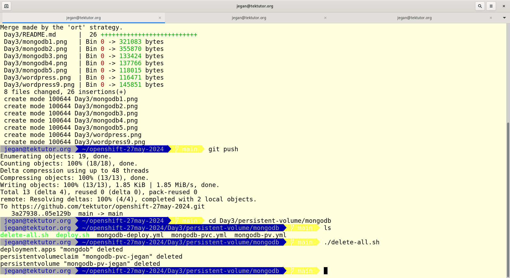


## Lab - Wordpress with mysql database
```
cd ~/openshift-27may-2024
git pull
cd Day3/persistent-volume/mongodb
./deploy.sh
```

## Lab - Deploying redis with persitence volume
```
cd ~/openshift-27may-2024
git pull
cd Day3/persistent-volume/redis
./deploy.sh
```

## Info - What is ConfigMap?
<pre>
- helps storing key/value pairs
- you could store configuration data
- environments
- developers can use it to store any non-sensitive data
- the values stored inside the configmap can be seen by anyone as it is stored in plain text
</pre>

## Info - What is Secret?
<pre>
- helps storing key/value pairs
- you could store sensitive data like certificates, login credentials, etc
- environments
- the values stored inside the secrets can't be seen by everyone
</pre>

## Lab - Using ConfigMap and Secrets to store configurable information, retrieve them securely and use it in deployments
```
cd ~/openshift-27may-2024
git pull
cd Day3/configmap-and-secrets
./deploy.sh
```

## Demo - Install helm package manager
```
curl -fsSL -o get_helm.sh https://raw.githubusercontent.com/helm/helm/main/scripts/get-helm-3
chmod +x ./get_helm.sh
./get_helm.sh
```

## Lab - Using helm package manager to package our wordpress multi-pod application and deploy our custom wordpress helm chart
```
cd ~/openshift-27may-2024
git pull
cd Day3/helm

helm create wordpress
cd wordpress/templates
rm -rf *
cd ../..
cp manifest-scripts/*.yml wordpress/templates
cp values.yaml wordpress
```

Make sure you values.yaml file looks as shown below
<pre>
nfs_server_ip: "192.168.1.108" 
nfs_wordpress_path: /var/nfs/jegan/wordpress 
nfs_mariadb_path: /var/nfs/jegan/mariadb
pv_label: jegan  
</pre>

Let's create the helm wordpress chart(package)
```
cd ~/openshift-27may-2024
git pull
cd Day3/helm
helm package wordpress
ls -l
```

Let's install the wordpress helm chart into the Openshift cluster
```
helm install wordpress-0.1.0.tgz
helm list
```

Expected output
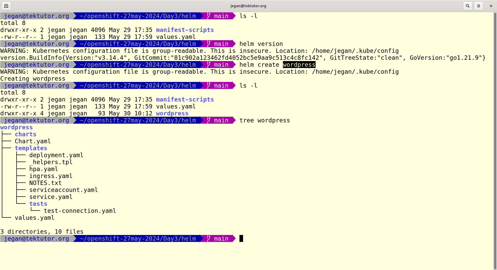
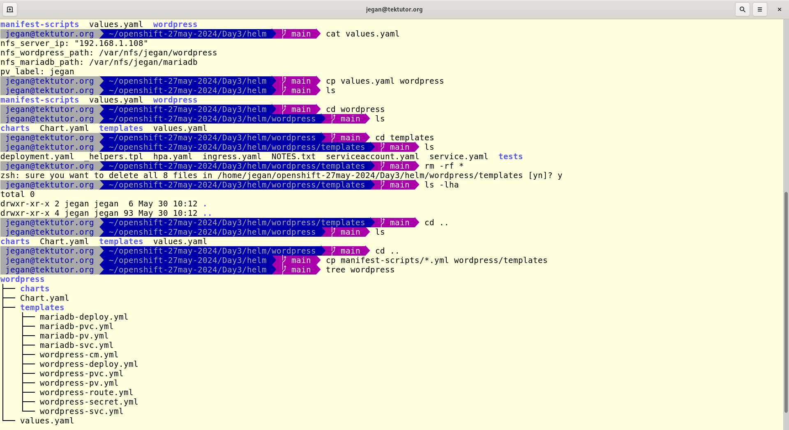
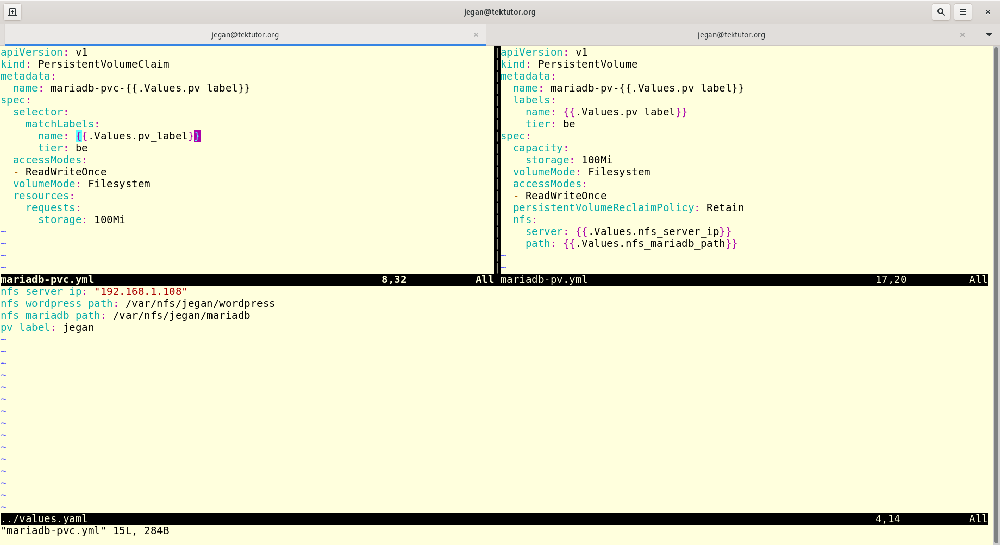
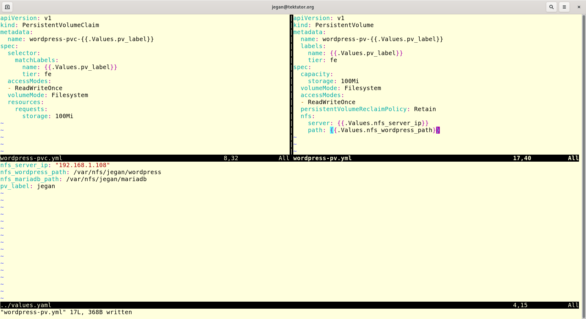
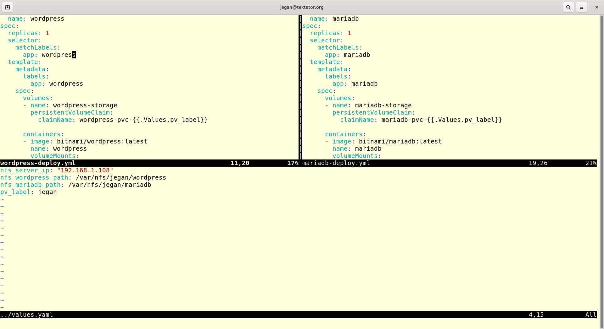
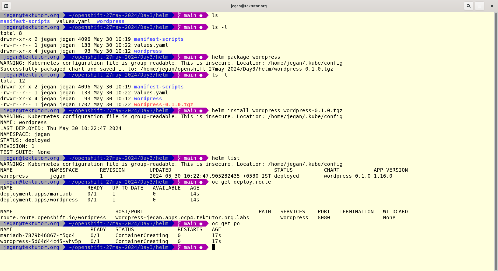
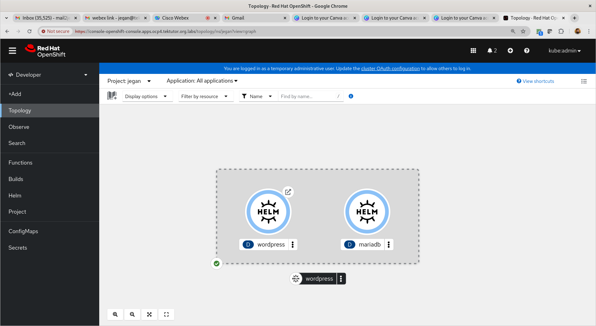
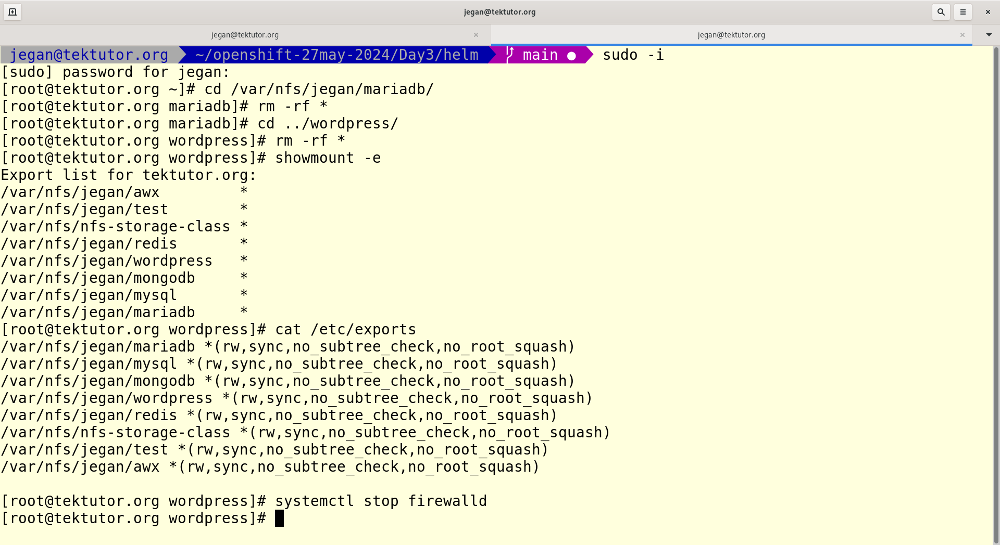

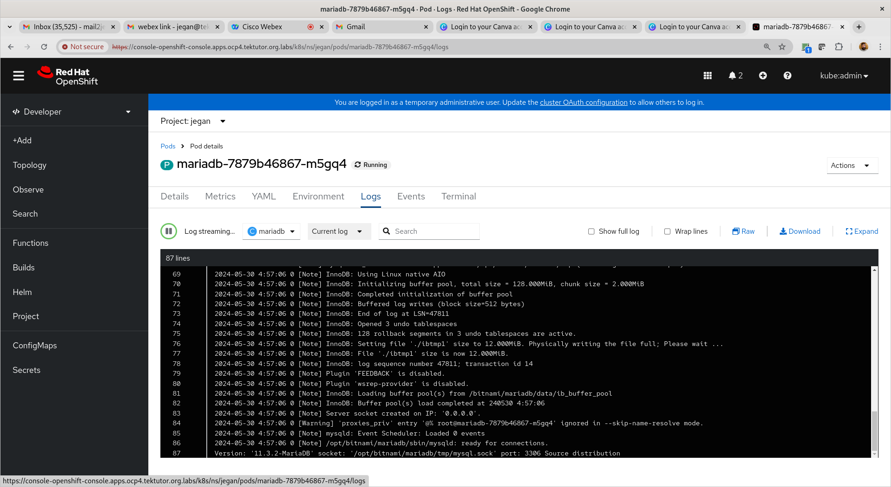
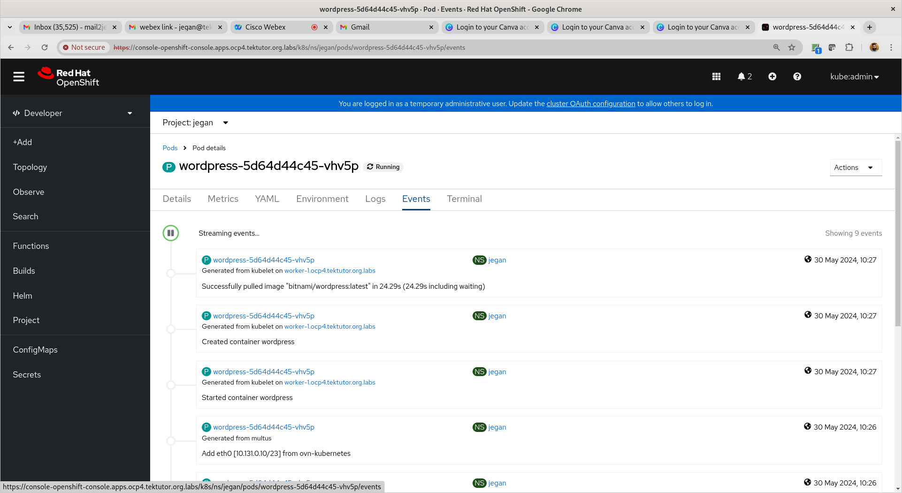
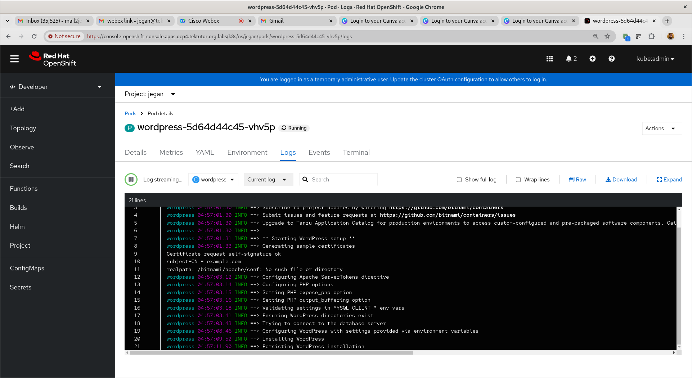
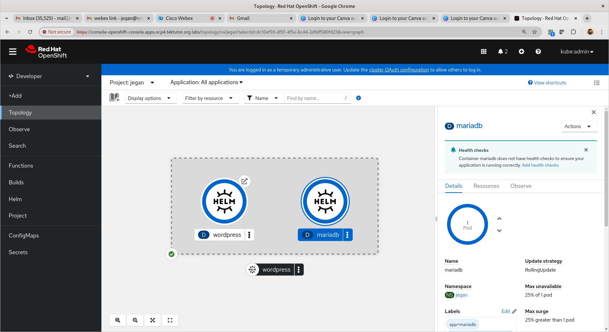

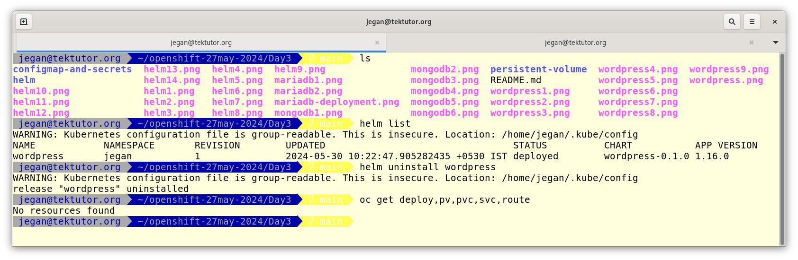


